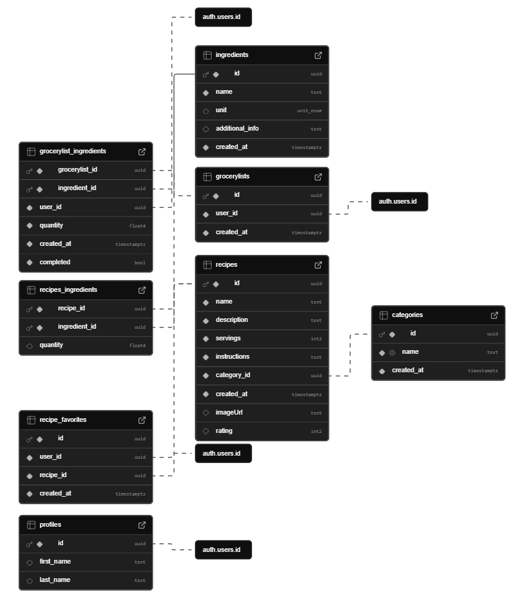

# Die Rezeptwelt

Eine All-in-One Rezeptplattform zum Entdecken, Erstellen und Verwalten von Rezepten mit integrierter Einkaufslistenfunktion.

[Hier kannst du die Live-Demo ansehen](https://rezept-supabase.netlify.app/)

## Funktionen

- **Benutzerauthentifizierung**: Vollständiges Anmelde- und Registrierungssystem mit Sitzungspersistenz
- **Rezepte entdecken**: Suche und Filterung von Rezepten mit detaillierten Ansichten
- **Eigene Rezepte**: Erstellen persönlicher Rezepte
- **Favoritensystem**: Speichern und organisieren bevorzugter Rezepte
- **Einkaufsliste**: Hinzufügen von Zutaten zur persönlichen Einkaufsliste mit Statusverwaltung
- **Responsive Design**: Optimiert für alle Geräte, von Mobiltelefonen (320px) bis Desktop

## Technologien

- **Frontend**: React, TypeScript, Tailwind CSS
- **State Management**: Zustand
- **Formularvalidierung**: Zod, React Hook Form
- **Backend & Datenbank**: Supabase
- **Routing**: React Router
- **Development**: Vite, npm

## Installation und Start

```bash
# Repository klonen
git clone https://github.com/manonsfoto/Die_Rezeptwelt_Supabase.git

# In das Projektverzeichnis wechseln
cd Die_Rezeptwelt_Supabase

# Abhängigkeiten installieren
npm install

# Entwicklungsserver starten
npm run dev
```

## Datenbankschema-Visualisierung



## Umgebungsvariablen

Erstellen Sie eine `.env`-Datei im Hauptverzeichnis mit folgenden Variablen:

```
VITE_SUPABASE_URL=Ihre-Supabase-URL
VITE_SUPABASE_ANON_KEY=Ihr-Anon-Key
```

## Projektstruktur

```
src/
├── components/         # UI-Komponenten
├── pages/              # Seitenkomponenten
├── store/              # Zustand-Stores
├── types/              # TypeScript-Typdefinitionen
├── validation/         # Zod-Validierungsschemas
├── utils/              # Hilfsfunktionen
└── actions.ts          # Zentralisierte Datenbankfunktionen
```

## Authentifizierung

Die Anwendung verwendet Supabase Auth mit:

- E-Mail/Passwort-Anmeldung
- Sitzungspersistenz
- Geschützte Routen

## Einkaufslistenfunktion

Nutzer können:

- Zutaten direkt aus Rezepten hinzufügen
- Mengen anpassen
- Elemente als erledigt markieren
- Die Liste vollständig leeren

## Projektvorschau

### Rezepte suchen


### Rezept zu Favoriten hinzufügen


### Meine Rezepte anzeigen


### Neues Rezept erstellen


### Zutat zur Einkaufsliste hinzufügen


### Meine Einkaufsliste


